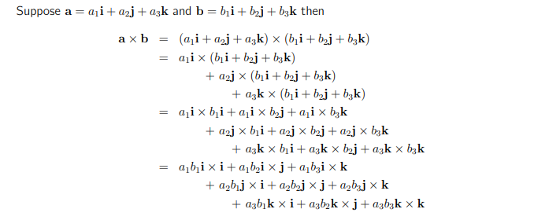

## Introdução
**Ray Tracing** é um algorítimo para criar gráficos realistas.

## Sub-problem No. 1
Qualquer Ray Tracing algorítimo requer a representação de objetos em um espaço 3D.

Um vetor é um segmento de reta que vai do ponto A para o ponto B em um plano 2D ou 3D.

Precisamos ser capaz de operar os vetores.

Normalizar um vetor envolve limitar o seu módulo/tamanho 1 e manter a sua posição. Isso pode ser útil em outras operações como cálculo de distância ou clusteting.

A fórmula para produto vetorial é dada por: 

Para implementação do cálculo foram abordados os seguintes passos:

- Criar lista vazia "new result"
- Interar sobre o vetor "result"
- A cada interação somar o valors anterior com o seguinte
- Guardar o valor dessa forma em "new_result"
- Mostrar "new_result"

Para implementar o cálculo da magnitude de um vetor:

### Problema
- Interar sobre os elementos do vetor
- Elevar cada um dele ao quadrado
- Somar os elementos
- Tirar a raiz quadrada do valor obtido

### Recursos
- for loop
- math.Pow(2, 10)
- append

### Plano
- Interar sobre o vetor v1 [x]
- Elevar cada um deles[x] ao quadrado 
- Guardar em outro vetor [x]
- Somar os valores desse novo vetor [x]

## Lins Úteis
- [Tour for Go](https:-go.dev/tour/moretypes/6)
- [Vector Representation in Go](https:-www.netguru.com/blog/vector-operations-in-go)
- [Vector Normalization](https:-www.khanacademy.org/computing/computer-programming/programming-natural-simulations/programming-vectors/a/vector-magnitude-normalization)
- [OOP in Golang](https:-www.tutorialspoint.com/golang-program-to-create-a-class-and-object#:~:text=Structs%20%E2%88%92%20Go%20language%20does%20not,same%20or%20different%20data%20type.)
- [Machine Learning with Go: Matrices and Vectors| packtpub.com
](https:-www.youtube.com/watch?v=rzYzsdKImEs)
- [Sum Vector JS Solution](https:-spellbox.app/spells/javascript/two-functions-that-make-sum-two-vectors-and-make-their-dot-product-in-javascript)
- [Golang - Apeend Func](https:-dev.to/andyhaskell/a-closer-look-at-go-s-slice-append-function-3bhb)
- [Passing & Returning Array To & From a Function | Go Tutorial](https:-www.youtube.com/watch?v=_mVLhNgQ7_8)
- [The vector product](https:-www.mathcentre.ac.uk/resources/uploaded/mc-ty-vectorprod-2009-1.pdf)